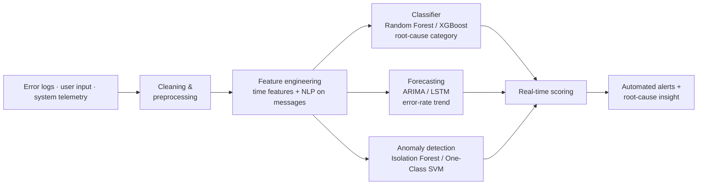

# Predictive Error Analysis & Root-Cause Identification (ML + NLP)

> Proactively predict failures and pinpoint root cause to cut MTTR · **~2017** · Python ML + NLP

**Role:** Data & AI Platform Architect (Data Scientist / ML Engineer)
**Type:** Portfolio case study — architecture & approach are representative; production code is proprietary.

---

## Context

A data/operations platform was generating errors faster than the team could triage them. Failures were reactive: someone noticed, someone dug through logs, someone eventually found the cause — and mean-time-to-repair suffered.

This project (**circa 2017**) turned historical error logs, user inputs and system telemetry into a predictive system that **classifies errors by root cause**, **forecasts error trends**, and **flags anomalies** before they cascade. It is the **ML / MLOps** stage of my journey — moving models out of notebooks and toward production monitoring, alerting and operational value.

## Architecture

## Tech stack

- **Languages:** Python
- **ML:** scikit-learn (Random Forest, Isolation Forest, One-Class SVM), XGBoost
- **Time series:** ARIMA, LSTM
- **NLP:** keyword extraction, sentiment/tone features on error messages
- **Ops:** real-time scoring, automated alerting, model monitoring & refinement

## Data model & architecture

- **Event-level feature schema** — each error becomes a feature vector: error type, component, user/session, timestamp, system parameters, plus engineered **time-based** features (hour-of-day, day-of-week) and **NLP-derived** features from the message text.
- **Labels by root-cause class** — user error vs system error vs configuration issue, enabling supervised classification.
- **Streaming inference contract** — the same feature transform runs at train and serve time to avoid skew.

## Key design decisions

- **Three complementary models, not one** — classification (what kind), forecasting (how much, soon), anomaly detection (something new) cover different failure questions.
- **Handle class imbalance explicitly** — rare-but-critical error classes weighted/resampled so they aren't drowned out.
- **NLP on the message, not just the code** — free-text error messages carry root-cause signal that structured fields miss.
- **Train/serve parity** — one shared feature pipeline to prevent the classic online/offline skew that silently degrades production models.

## Outcome & impact

- **Proactive** identification of likely failures before they hit users.
- **Reduced MTTR** through automated root-cause categorization and faster triage.
- **Higher reliability** by addressing recurring underlying causes, not just symptoms.
- Established the monitoring/alerting and model-lifecycle patterns that mature into governed MLOps on the lakehouse.

## Where this sits in my journey

Part of my **Data & AI Platform Architect** portfolio — the **~2017 ML / MLOps** stage.

⏮ prev: [market-performance-analytics-python-ml](https://github.com/kamalakarpeta/market-performance-analytics-python-ml) · ⏭ next: [yield-curve-outlier-detection-aws-streamlit](https://github.com/kamalakarpeta/yield-curve-outlier-detection-aws-streamlit)
Full journey: https://kamalakarpeta.github.io

## Contact

LinkedIn: https://www.linkedin.com/in/kamalakarpeta/
