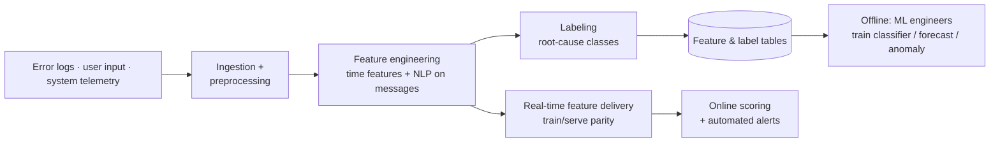

# Error Telemetry Pipeline for Predictive RCA (Data Engineering for ML)

> The ingestion + feature pipeline that feeds ML-driven error prediction and root-cause analysis · **~2017** · Python data engineering for ML

**Role:** Data & AI Platform Architect (Data Engineer / ML platform)
**Type:** Portfolio case study — architecture & approach are representative; production code is proprietary.

---

## Context

A platform was emitting errors faster than the team could triage them, and the **ML engineers** tasked with predicting and classifying those failures had no reliable data to work from — logs were raw, unlabeled and scattered across systems.

This project (**circa 2017**) is **data engineering for ML**: I built the pipeline that ingests error logs, user inputs and system telemetry; engineers the features (including **NLP-derived** signals from message text); produces labeled, query-ready **feature and serving tables**; and exposes a consistent **train/serve data contract**. The ML engineers then built the classifiers, forecasts and anomaly detectors **on top of my data** — they owned the models, I owned the data substrate and the real-time feature delivery that made the models possible. It marks the stage where I began serving **ML engineers** as a downstream consumer.

## Architecture

## Tech stack

- **Languages:** Python
- **Data pipeline:** ingestion, preprocessing, feature engineering, labeling
- **NLP feature extraction:** keyword/sentiment features on error messages (data prep, not model ownership)
- **Serving:** real-time feature delivery, online scoring contract, automated alerting hooks
- *(Downstream, by ML engineers: Random Forest/XGBoost classifiers, ARIMA/LSTM forecasts, Isolation Forest/One-Class SVM anomaly detection)*

## Data model & architecture

- **Event-level feature schema** — each error becomes a feature vector (error type, component, user/session, timestamp, system params) enriched with engineered **time-based** and **NLP-derived** features.
- **Label tables** — root-cause categories (user / system / configuration) maintained as a curated labeling layer so the ML engineers get supervised training data.
- **Train/serve parity contract** — one shared feature transform runs offline and online, so the ML team's models don't suffer online/offline skew. The pipeline owns this guarantee.

## Key design decisions

- **Own the data contract, not the model** — my deliverable is reliable features, labels and a skew-free serving path; classification and anomaly detection are the ML engineers' workload I enable.
- **Engineer NLP features at the data layer** — extracting signal from free-text messages upstream means every model the team builds inherits it for free.
- **Train/serve parity by construction** — a single feature transform prevents the silent production degradation that kills ML projects.
- **Labeling as a first-class pipeline output** — curated, consistent labels are what make supervised modeling downstream even possible.

## Outcome & impact

- **Unblocked the ML team** — reliable features and labels turned raw logs into a trainable, serveable dataset.
- **Production-ready feature delivery** — train/serve parity let the resulting models run online without skew.
- **Reduced MTTR (downstream)** — the models built on this pipeline enabled proactive detection and faster root-cause triage.
- Established the **feature-pipeline and serving-contract** patterns that mature into governed MLOps and, later, GenAI retrieval on the lakehouse.

## Where this sits in my journey

Part of my **Data & AI Platform Architect** portfolio — the **~2017** stage, where my pipelines began explicitly serving ML engineers.

⏮ prev: [market-performance-analytics-python-ml](https://github.com/kamalakarpeta/market-performance-analytics-python-ml) · ⏭ next: [yield-curve-outlier-detection-aws-streamlit](https://github.com/kamalakarpeta/yield-curve-outlier-detection-aws-streamlit)
Full journey: https://kamalakarpeta.github.io

## Contact

LinkedIn: https://www.linkedin.com/in/kamalakarpeta/
